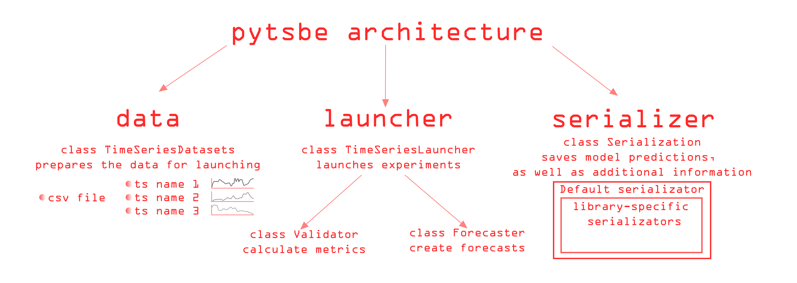

**Py**thon **t**ime **s**eries **be**nchmark. The main goal of this repository is to allow researchers and developers 
to compare several time series forecasting models or libraries. The repository contains data and the necessary wrappers 
for forecasting univariate and multivariate time series.

## Description

### Univariate time series 

The repository includes the following libraries and models for comparison:
- [FEDOT](https://github.com/nccr-itmo/FEDOT) - AutoML framework which supports the time series forecasting task
- [AutoTS](https://github.com/winedarksea/AutoTS) - Automated time series forecasting library
- [pmdarima](https://github.com/alkaline-ml/pmdarima) - A statistical library to fit ts models
- [prophet](https://github.com/facebook/prophet) - a procedure for forecasting time series data based on an additive model
- [H2O](https://github.com/h2oai/h2o-3) - (lagged transformation + H2O) AutoML platform for tabular data
- [TPOT](https://github.com/EpistasisLab/tpot) - (lagged transformation + TPOT) Tree-based Pipeline Optimization Tool. AutoML library for tabular data
- naive forecaster - repeat last observation
- naive forecaster - forecasts the average value of the time series
- naive forecaster ETS - Simple exponential smoothing model

Available datasets (check data folder): 
- [FRED](./data/fred.csv) ([license](https://fred.stlouisfed.org/legal/)) - Federal Reserve Economic Data is an online database consisting of economic data time series (source [link](https://fred.stlouisfed.org/))
- [TEP](./data/tep.csv) ([license](https://github.com/YKatser/CPDE/tree/master/TEP_data)) - Tennessee Eastman Process (TEP) is a model of the industrial chemical process (source [link](https://paperswithcode.com/dataset/tep))
- [SMART](./data/smart.csv) - the readings with a time span of 1 minute of house appliances in kW from a smart meter and weather conditions (source [link](https://www.kaggle.com/datasets/taranvee/smart-home-dataset-with-weather-information))

Below is a brief description of datasets:

TODO update table after recalculations
| Dataset | Total number of   time series | Average row   length | Minimum row   length | Maximum row   length | Percentage of   non-stationary   time series |
| :---------: | :---------------------------------------: | :------------------------------: | :------------------------------: | :------------------------------: | :--------------------------------------------------------------: |
| FRED        | 12                                        | 3674                             | 468                              | 17520                            | 67                                                               |
| TEP         | 41                                        | 12801                            | 12801                            | 12801                            | 5                                                                |
| SMART       | 28                                        | 503911                           | 503911                           | 503911                           | 21                                                               |

### Multivariate time series 

TODO add description 

## Documentation

See [documentation](./docs) for a more detailed explanation. 

## Results table

TODO add the results 

## Contributing 
This module is designed so that you can add your library to it as easily as possible. 

 

Follow these steps to make the changes:
- Make a fork of this repository, or create a separate branch
- Add a new Forecaster class
- If required, add a new class to serialize additional launch information
- Create a pull request and ask our team to review it
- After the code review, correct our notes and merge the code into the main branch

## Citation 

Nikitin, Nikolay O., et al. "[Automated evolutionary approach for the design of composite machine learning pipelines.](https://doi.org/10.1016/j.future.2021.08.022)" 
Future Generation Computer Systems 127 (2022): 109-125.

Other papers - in [ResearchGate](https://www.researchgate.net/project/Evolutionary-multi-modal-AutoML-with-FEDOT-framework)