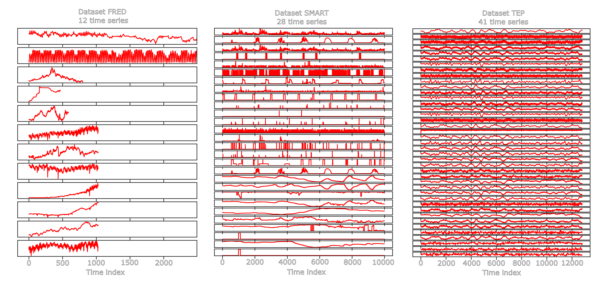
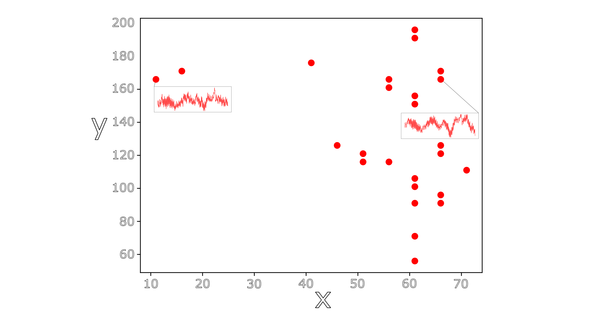
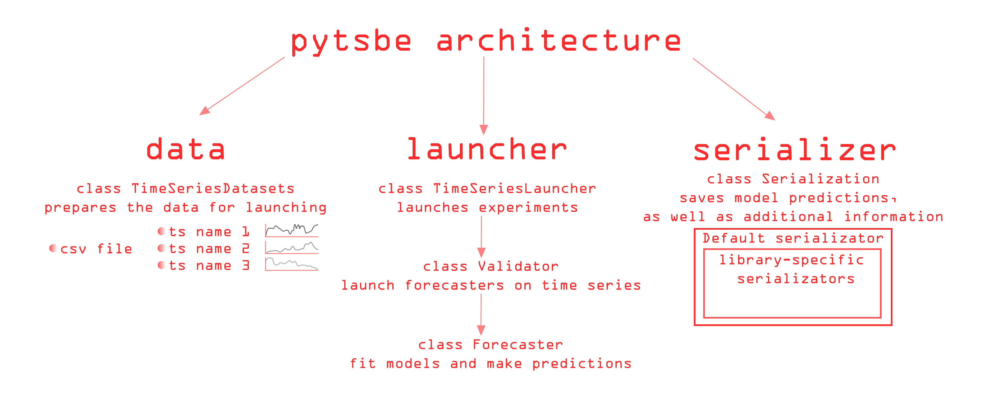

**Py**thon **t**ime **s**eries **be**nchmark. The main goal of this repository is to allow researchers and developers 
to compare several time series forecasting models or libraries. The repository contains data and the necessary wrappers 
for forecasting univariate and multivariate time series.

## Description

### Univariate time series

#### Libraries

_Which can be used to predict univariate time series_

The repository includes the following libraries and models for comparison:
- [FEDOT](https://github.com/nccr-itmo/FEDOT) - AutoML framework which supports the time series forecasting task. Name in the repository `FEDOT`.
- [AutoTS](https://github.com/winedarksea/AutoTS) - Automated time series forecasting library. Name in the repository `AutoTS`.
- [pmdarima](https://github.com/alkaline-ml/pmdarima) - A statistical library to fit ts models. Name in the repository `pmdarima`.
- [prophet](https://github.com/facebook/prophet) - a procedure for forecasting time series data based on an additive model. Name in the repository `prophet`.
- [H2O](https://github.com/h2oai/h2o-3) - (lagged transformation + H2O) AutoML platform for tabular data. Name in the repository `H2O`.
- [TPOT](https://github.com/EpistasisLab/tpot) - (lagged transformation + TPOT) Tree-based Pipeline Optimization Tool. AutoML library for tabular data. Name in the repository `TPOT`.
- naive forecaster - repeat last observation. Name in the repository `repeat_last`.
- naive forecaster - forecasts the average value of the time series. Name in the repository `average`.
- naive forecaster ETS - Simple exponential smoothing model. Name in the repository `ets`.

#### Datasets

Available datasets (check data folder): 
- [FRED](./data/fred.csv) ([license](https://fred.stlouisfed.org/legal/)) - Federal Reserve Economic Data is an online database consisting 
  of economic data time series (source [link](https://fred.stlouisfed.org/)). Name in the repository `FRED`.
- [TEP](./data/tep.csv) ([license](https://github.com/YKatser/CPDE/tree/master/TEP_data)) - Tennessee Eastman Process (TEP) is a
  model of the industrial chemical process (source [link](https://paperswithcode.com/dataset/tep)). Name in the repository `TEP`.
- [SMART](./data/smart.csv) - the readings with a time span of 1 minute of house appliances in kW from a 
  smart meter and weather conditions (source [link](https://www.kaggle.com/datasets/taranvee/smart-home-dataset-with-weather-information)). 
  Name in the repository `SMART`.

Below is a brief description of datasets:

| Dataset | Total number of <br> time series | Average row <br> length | Minimum row <br> length | Maximum row <br> length | Percentage of <br> non-stationary <br> time series |
| :---------: | :---------------------------------------: | :------------------------------: | :------------------------------: | :------------------------------: | :--------------------------------------------------------------: |
| FRED        | 12                                        | 3674                             | 468                              | 17520                            | 67                                                               |
| TEP         | 41                                        | 12801                            | 12801                            | 12801                            | 5                                                                |
| SMART       | 28                                        | 503911                           | 503911                           | 503911                           | 21                                                               |

And visualisations:
 


### Multivariate time series 

#### Libraries

_Which can be used to predict multivariate time series_

The repository includes the following libraries and models for comparison:
- [FEDOT](https://github.com/nccr-itmo/FEDOT) - AutoML framework which supports both univariate and multivariate time
 series forecasting tasks. Name in the repository `FEDOT`.


#### Datasets

At the moment, the repository contains one dataset of multivariate time series forecasting:
- [SSH](./data/multivariate_ssh.csv) - Data were collected by simulating the sea surface height (SSH) using NEMO 
(Nucleus for European Modelling of the Ocean) model.
The data contain measurements of sea level (in meters) in different geographical locations. For each time series, the 
coordinates (x and y) and the label are known. For each series, it is required to generate a forecast based on the previous 
values of the current and all other time series. 
Name in the repository `SSH`.

The picture below shows the location of the time series and shows examples of the structures of some of them.

 

The model is designed to iteratively generate a forecast for each time series in the dataset.
 It is possible to use the historical values of not only the target series but 
 also the neighboring (exogenous time series).

## Documentation

See [documentation](./docs) for a more detailed explanation. 

## Results table

According to our [experiments](./experiments).

In progress


## Install
Use the following command to install this module

```
pip install git+https://github.com/ITMO-NSS-team/pytsbe.git
```

## Contributing 
This module is designed so that you can add your library to it as easily as possible. 

 

Follow these steps to make the changes:
- Make a fork of this repository, or create a separate branch
- Add a new Forecaster class
- If required, add a new class to serialize additional launch information
- Create a pull request and ask our team to review it
- After the code review, correct our notes and merge the code into the main branch

And check [contribution guide](docs/contributing.md) for more details. 

## Citation 

Nikitin, Nikolay O., et al. "[Automated evolutionary approach for the design of composite machine learning pipelines.](https://doi.org/10.1016/j.future.2021.08.022)" 
Future Generation Computer Systems 127 (2022): 109-125.

Other papers - in [ResearchGate](https://www.researchgate.net/project/Evolutionary-multi-modal-AutoML-with-FEDOT-framework)