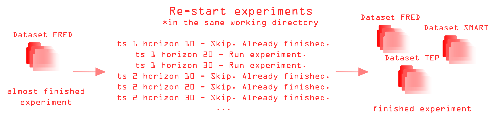

# Common documentation description 

Welcome to the main documentation page of **pytsbe** library. 

## Useful features (why you should try pytsbe)

The module allows a variety of experiments to be carried 
out on different time series, as well as flexible configuration
of experiment conditions and library parameters.

The evaluation process is divided into two parts: running
experiments and creating report (calculating metrics and display plots). During the first stage,
csv files with model predictions are generated, 
as well as json files with `fit` and `predict` method execution times for 
each model / library. Once the experiments have been completed, the library 
functionality can be used to generate reports, calculate metrics and plot
graphs. Since predictions are saved, as well as additional information if desired, 
it is always possible to calculate further metrics and construct new graphs (especially useful
when writing scientific papers).


**The advantages of this module are:**
- Various time series and libraries have already been integrated into 
  the repository, and the wrappers have been tested and are ready for use

 

- Ability to perform validation both on the last segment 
  of the time series and to use in-sample forecasting
  
 

- While it is running, the algorithm saves the conditions of the experiment
  so that it can be reproduced in the future (saves a configuration file) 


- The algorithm will continue to work even if the model fails during the calculations. 
  Then the result for this case will not be generated and the algorithm moves on to the next 
  


- Ability to restart experiments if they were previously stopped 
  for unexpected reasons. In this case, the algorithm will check which cases have already been calculated and start from where it left off
  


- If you re-run the experiment in the existing working directory and change the experiment conditions, the module will detect the problem
  (compare it to the existing configuration file) and warn you

## Quick start

The `TimeSeriesLauncher` class is used to run the experiments.  

### Initialization parameters

`working_dir` - directory for saving algorithm output. If the directory does not exist, it will be created

`datasets` - a list of dataset names.

`launches` - number of launches to perform.

### perform_experiment method parameters

`libraries_to_compare` - a list of libraries names.

`horizons` - a list of forecast horizons names

`libraries_params` - dictionary with parameters for libraries.

`validation_blocks` - validation blocks for in-sample forecasting. If None or 1 - simple validation is made.

`clip_border` - number of elements to remain in time series if there is a need to clip time series (if None - there is no cropping).

Usage example:
```Python
from pytsbe.main import TimeSeriesLauncher

experimenter = TimeSeriesLauncher(working_dir='./output',
                                  datasets=['FRED', 'TEP', 'SMART'],
                                  launches=2)

experimenter.perform_experiment(libraries_to_compare=['FEDOT', 'AutoTS', 'pmdarima', 'repeat_last'],
                                horizons=[10, 20, 30, 40, 50, 60, 70, 80, 90, 100],
                                libraries_params={'FEDOT': {'preset': 'ts', 'timeout': 2},
                                                  'AutoTS': {'frequency': 'infer', 'prediction_interval': 0.9,
                                                             'ensemble': 'all', 'model_list': 'default',
                                                             'max_generations': 1, 'num_validations': 3}},
                                validation_blocks=3,
                                clip_border=1000)
```

## Advanced features

In progress

## Running experiments stage algorithm output 

A large number of nested folders are generated during execution. The hierarchy is always as follows: 
`Dataset name -> Launch number -> Library name (model name)`. Remember that each dataset contains 
several time series. And at the same time for each time series it is necessary to perform several 
experiments with different forecast horizons. 
So, each such folder will store algorithm predictions (csv) and time measurements 
(json). The file names are formed as follows: `<time series label>_<forecast horizon>_forecast_vs_actual.csv`
and `<time series label>_<forecast horizon>_timeouts.json`. Additional objects can also be stored in the folder 
(check serializers). 

## Preparing report stage. Creating reports

In progress 

## Preparing report stage. Report visualisation

In progress 

## Contributing

Check [contribution guide](contributing.md) for more details.